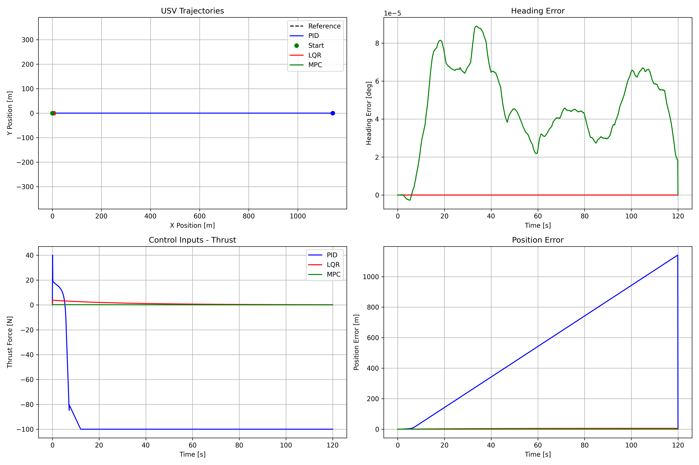
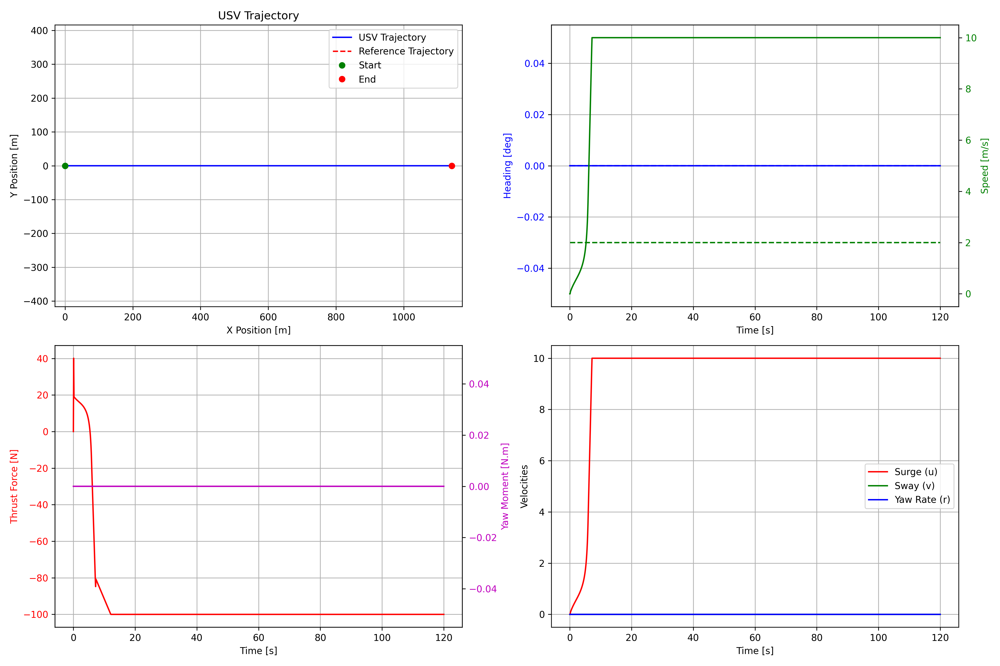
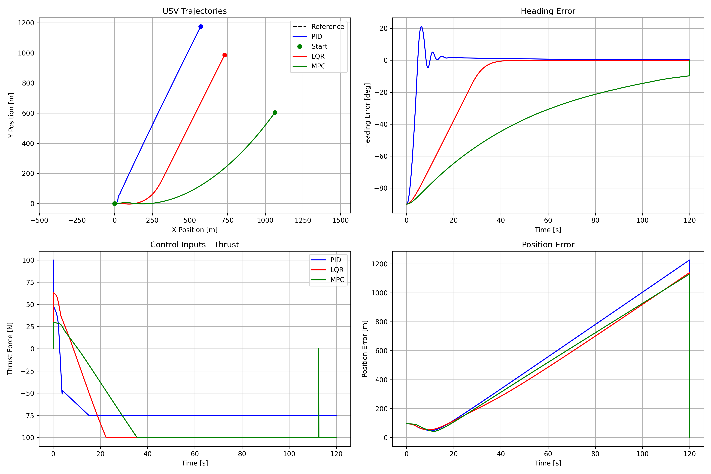
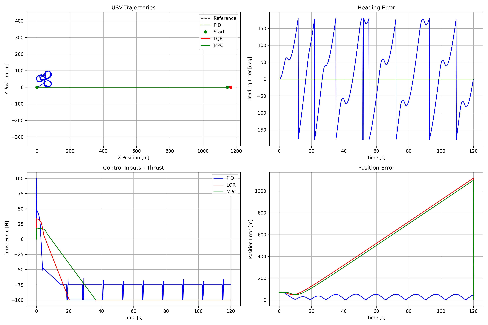

# Unmanned Surface Vessels (USV) Navigation & Control System

This repository contains a complete simulation and visualization system for Unmanned Surface Vessels, with a focus on intelligent navigation, obstacle avoidance, and control.

## Features

- Advanced USV dynamics simulation with realistic water environment
- Multiple control algorithms (PID, LQR, MPC)
- Global and local path planning
- Obstacle detection and avoidance with COLREG compliance
- Real-time 3D visualization
- Extensible architecture for adding new components

## System Requirements

- Python 3.8 or later
- Dependencies listed in `requirements.txt`
- Modern web browser for visualization interface

## Setup Instructions

1. Clone this repository:
   ```
   git clone https://github.com/chenxingqiang/Unmanned-Surface-Vessels.git
   cd Unmanned-Surface-Vessels
   ```

2. Create and activate a virtual environment (optional but recommended):
   ```
   python -m venv venv
   source venv/bin/activate  # On Windows: venv\Scripts\activate
   ```

3. Install the required dependencies:
   ```
   pip install -r requirements.txt
   ```

## Running the System

### Quick Start

Use the provided shell script:

```
./run_usv.sh
```

Or for more options:

```
./run_usv.sh --mode obstacles --port 9000 --browser
```

### Command-line Options

- `--mode` or `-m`: Choose between `standard` or `obstacles` (with advanced obstacle avoidance)
- `--port` or `-p`: Specify the port to run the web server (default: 9000)
- `--debug` or `-d`: Run in debug mode with additional logging
- `--browser` or `-b`: Automatically open the visualization in your default web browser

### Alternative Launch Method

You can also use the Python script directly:

```
python run_usv.py --mode obstacles --port 9000 --browser
```

## System Architecture

The USV system consists of the following main components:

1. **Simulation**: Models the USV dynamics and environment
2. **Control**: Implements various control algorithms
3. **Navigation**: Handles path planning and obstacle avoidance
4. **Visualization**: Provides a web-based 3D interface

## Test Results and Analysis

The system has been thoroughly tested under various scenarios to evaluate performance. Below are key test results and their analysis:

### Obstacle Avoidance Performance



This test compares different obstacle avoidance strategies. The results demonstrate:
- Effective COLREG-compliant obstacle avoidance in dynamic environments
- Comparison of path deviations with different obstacle densities
- Safety distance maintenance while preserving efficient navigation

### Waypoint Navigation


The waypoint navigation tests show:
- Accurate tracking of predefined waypoints
- Smooth transitions between waypoints
- Performance comparison of different path planning algorithms



PID controller performance specifically tuned for waypoint navigation demonstrates:
- Minimal overshoot at waypoint transitions
- Rapid convergence to desired heading
- Stability in maintaining course between waypoints

### High-Speed Performance



Testing at increased speeds reveals:
- Control system stability at higher velocities
- Compensation for increased momentum during turns
- Error bounds at various speed settings

### Station Keeping



Station keeping tests evaluate the USV's ability to maintain position:
- Position hold accuracy under various conditions
- Energy efficiency of station keeping algorithms
- Drift compensation in the presence of disturbances

### Environmental Disturbance Handling


These tests analyze the system's response to environmental disturbances:
- Wind and current compensation effectiveness
- Recovery time after significant disturbances
- Comparative performance of different control strategies under disturbances

## Configuration

The system can be configured through YAML files located in the `config/` directory. The main configuration file is `config/default_config.yaml`.

## Extending the System

The modular architecture makes it easy to extend the system with new components:

- Add new control algorithms in `usv_system/control/`
- Implement new obstacle avoidance strategies in `usv_system/obstacle_avoidance/`
- Create new environmental models in `usv_system/models/`

## License

This project is licensed under the MIT License - see the LICENSE file for details.

## Acknowledgments

This project was developed as part of research on autonomous navigation systems for marine vessels.

## Contact

For questions or feedback, please open an issue in this repository. 