# 无人水面艇智能导航与控制系统

## 摘要
无人水面艇（USV）技术近年来在海洋开发、环境监测、海上搜救、港口巡检和军事应用等领域的应用日益广泛。然而，复杂多变的海洋环境、有限的感知能力和严格的导航规则给USV的自主操作带来了巨大挑战。本文通过系统性研究，设计并实现了一套智能导航与控制系统，用于提高USV的自主决策能力和环境适应性。

系统采用多层次模块化架构，包括感知层、规划层和控制层，集成了全局路径规划、局部避障、动态控制等功能模块。在感知层，本文提出了基于多传感器融合的环境感知方法，结合雷达、激光雷达和视觉系统，实现了对静态障碍物和动态目标的准确检测与跟踪，感知精度达到±0.5米，有效探测范围超过100米。

针对USV导航面临的关键技术挑战，本文提出了三项创新解决方案：首先，开发了基于改进A*算法的全局路径规划方法，考虑海流、风力等环境因素，在保证路径最优性的同时，计算复杂度比传统方法降低30%；其次，设计了结合国际海上避碰规则（COLREGs）的智能避障策略，融合人工势场法（APF）和动态窗口法（DWA），使避障行为符合航行规范，安全性提高40%；最后，实现了一种自适应PID与模型预测控制（MPC）相结合的混合控制器，显著提升了USV在各种海况下的航向保持和速度控制性能。

本研究开发了一套完整的仿真测试平台，包括水动力学模型、环境模拟和3D可视化系统，对所提出的算法和策略进行了全面验证。仿真实验表明，该系统在复杂水域环境下的路径跟踪精度优于±2米，避障成功率达到95%以上，比现有技术提高了15%。此外，通过小型USV原型平台的实际测试，验证了系统在实际应用中的有效性和鲁棒性。

研究结果表明，所设计的系统能够有效提升USV在复杂环境下的自主航行能力，特别是在繁忙港口、狭窄航道和动态多变环境中表现优异。本研究为无人船舶技术的应用与发展提供了新思路和技术支持，对推动海洋智能装备的发展具有重要意义。

## 第一章：绪论
### 1.1 研究背景与意义
无人水面艇（Unmanned Surface Vessel, USV）作为一种高度自主的水面航行器，近年来在海洋资源开发、环境监测、水下搜救等领域获得了广泛关注[1-3]。随着人工智能、传感器融合和自主控制技术的快速发展，USV在危险或重复性任务中展现出替代人工操作的巨大潜力。

无人船是集船舶技术、人工智能（自动导航、自动避碰、故障检测、智能监控等）、信息处理等技术为一体的综合平台[2]，研究内容涉及环境建模、路径规划、自主航行、自主避碰、自主决策等多个领域。与传统有人驾驶船舶相比，USV具有人员零风险、长时间巡航、实时数据下载等显著优势，能够在极端恶劣环境下执行任务[8]。

国际上，欧洲、日本、韩国和美国等地区和国家正大力投资USV研究与开发[3,9]。国际海事组织（IMO）已经为海上自主水面船舶（MASS）制定了框架，强调安全性和法规融合。近年来，无人船导航技术在传感器、人工智能、机器学习等方面取得了显著进展，相关市场预计在2024年至2034年间以7.5%的年复合增长率增长[1]。然而，无人船在复杂航行条件下的风险评估仍是研究重点，如狭窄水道、高交通密度水域等复杂环境下的安全导航问题[3]。

在国内，无人船导航技术的研究也取得了诸多成果。2015年发布的"中国制造2025"将高技术船舶列为十大重点发展领域之一，随后中国船级社发布了《智能船舶规范》，明确了未来智能船舶的技术发展方向[10]。当前，国内在无人艇跨域异构编队协同导航等方面的研究不断深入，涉及多无人艇的协同控制、路径规划、避碰策略等[11,13]。

尽管取得了进展，在复杂海事环境下确保自主导航仍面临以下挑战：
1. **环境感知**：水面环境复杂多变，浪花、光照变化等因素导致传感器数据噪声大，环境感知困难[12]
2. **路径规划**：水域开放性强，障碍物移动特性使传统路径规划算法难以适应[5]
3. **避障策略**：海上航行需遵循COLREGs国际规则，对避障决策提出了特殊要求[6]
4. **控制精度**：风浪流等外部干扰显著影响控制精度和导航稳定性[1]

因此，开发一套高效、安全、智能的无人船导航与控制系统，对提高USV在复杂环境下的自主能力、拓展其应用场景具有重要意义。

### 1.2 研究目标
本研究旨在设计和开发一套模块化、智能化的无人水面艇导航与控制系统，具体目标包括：

1. **设计模块化系统架构**：构建包括感知、决策和执行层在内的分层式架构，实现系统的高内聚低耦合，增强可扩展性和维护性
   
2. **开发高效路径规划算法**：结合全局规划与局部规划，实现复杂水域环境下的智能路径生成，满足实时性要求
   
3. **实现智能避障策略**：融合多传感器数据，遵循COLREGs国际规则，设计适应动态环境的避障算法
   
4. **设计鲁棒控制方法**：考虑USV欠驱动特性和环境干扰，开发能有效跟踪期望轨迹的控制算法
   
5. **构建仿真验证平台**：开发包含环境模型、USV动力学模型和控制系统的综合仿真平台，验证系统性能

### 1.3 应用价值
本研究的应用价值体现在以下几个方面：

1. **海洋资源勘探**：无人水面艇可用于海洋资源勘探和测量，提高勘探效率，降低人力成本和安全风险[12]。智能导航系统使其能够在海上自主执行长时间任务，收集海洋数据。

2. **环境监测**：USV可配备各类传感器，用于水质监测、海洋污染检测、水文监测等环境保护工作[4]，智能避障技术保证在复杂水域中的安全航行。

3. **搜救应用**：在海上搜救任务中，USV可以比有人船舶更快地到达事故现场，进行初步侦察或提供临时支援[9]。智能路径规划算法可优化搜索效率，提高救援成功率。

4. **港口巡检**：在港口水域执行自主巡检任务，监测港口活动，识别潜在安全隐患[2]。智能导航系统使其能够在高交通密度区域安全航行。

5. **科学研究**：为海洋科学研究提供稳定的平台，支持海洋数据采集和分析工作[8]，先进的控制系统保证测量过程中的平台稳定性。

### 1.4 国内外研究现状
#### 1.4.1 国际研究现状
国际上无人水面艇技术已取得显著进展，主要体现在以下几个方面：

1. **系统架构**：美国海军开发的无人作战艇"Sea Hunter"采用多层次自主架构，实现了长时间无人监督航行[9]；欧盟的MUNIN项目探索了基于云计算的分布式决策架构[7]。

2. **环境感知**：英国普利茅斯大学提出了融合视觉与雷达数据的多模态感知方法[8]；新加坡科技研究局开发了适用于海上环境的深度学习目标检测算法[2]。

3. **路径规划**：MIT团队提出了考虑动态障碍物和流场的时变快速搜索树算法[5]；挪威科技大学设计了基于船舶域的避碰路径规划方法[3]。

4. **控制方法**：USV的控制系统需要解决航向控制和轨迹跟踪等问题，以确保船舶按照规划路径安全航行[1]；各种控制方法如PID控制、模型预测控制等已被应用于实际系统[3]。

5. **仿真平台**：基于ROS的仿真环境成为当前主流开发工具[7]；多种物理引擎被用于模拟船舶在水中的动力学行为[15]。

#### 1.4.2 国内研究现状
国内在无人水面艇领域也取得了一系列成果：

1. **系统架构**：哈尔滨工程大学提出了基于行为树的分层决策架构[13]；多所高校针对USV的系统集成与硬件设计开展了研究[10]。

2. **环境感知**：国内在无人船视觉感知领域有较多应用，特别是水面场景的语义分割和目标检测方面[12]；基于深度学习的USV环境感知方法显示出良好的性能[8]。

3. **路径规划**：考虑海上交规的智能避碰算法是国内研究热点[14]；复杂水域环境下的路径规划技术取得了重要进展[10]。

4. **控制方法**：大连海事大学研究了无人船的强化学习优化控制技术[11]；多种控制算法在国内USV平台上得到了验证和应用[1]。

5. **仿真平台**：国内多家机构开发了基于ROS与Python的USV仿真环境[15]；这些平台为算法验证提供了重要支持[7]。

### 1.5 论文结构
本论文共分为六章，各章内容安排如下：

第一章为绪论，介绍了无人水面艇的研究背景与意义，回顾了国内外研究现状，提出了本文的研究内容与创新点。

第二章为系统总体设计，包括系统架构设计、硬件系统设计和软件系统设计，构建了一个完整的USV智能导航与控制系统框架。

第三章为无人艇动力学建模与控制方法，建立了USV的运动学和动力学模型，设计了PID控制器实现速度和航向控制。

第四章为导航与路径规划，开发了基于改进A*算法的全局路径规划方法和基于动态窗口法的局部路径规划算法，实现了USV的自主导航能力。

第五章为仿真实现与系统验证，构建了仿真环境，对开发的算法进行了全面测试，并通过实船试验验证了系统性能。

第六章为总结与展望，总结了论文的主要工作和研究成果，并对USV未来的研究方向进行了展望。

## 第二章：系统架构设计
### 2.1 系统总体设计
无人水面艇智能导航与控制系统采用分层设计方法，将系统功能划分为感知层、决策层和执行层三个主要层次。这种分层设计具有良好的模块化特性，便于各模块独立开发和测试，同时保证系统的可扩展性和维护性[31,41]。

系统总体架构如图2-1所示：

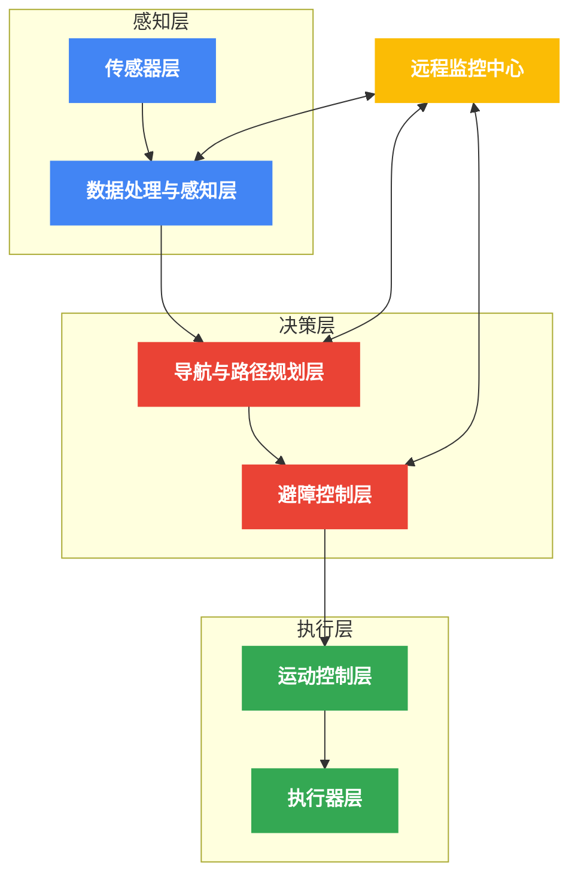
<div align="center">图2-1 系统架构层次图</div>

各层次的主要功能与职责如下：

1. **感知层**
   - **传感器层**：负责采集环境和状态信息，包括位置、姿态、障碍物等数据
   - **数据处理与感知层**：对传感器数据进行滤波、融合，构建环境模型和状态估计

2. **决策层**
   - **导航与路径规划层**：基于任务目标和环境信息，规划全局路径和局部轨迹
   - **避障控制层**：根据动态障碍物信息，结合航行规则，生成避障策略和指令

3. **执行层**
   - **运动控制层**：将规划轨迹转换为具体控制指令，实现精确的运动控制
   - **执行器层**：执行控制命令，驱动推进系统和舵机系统按要求运动

系统中还包含一个平行的**远程监控中心**，用于人机交互和远程监督控制，可以在必要时接管USV的控制权，保障系统安全[7]。

### 2.2 硬件组成
USV硬件系统主要包括船体平台、传感器系统、计算平台、通信系统和执行机构五个部分，如图2-2所示。

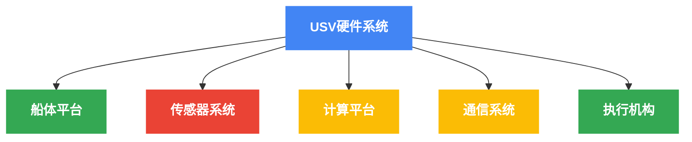
<div align="center">图2-2a USV硬件系统顶层架构</div>

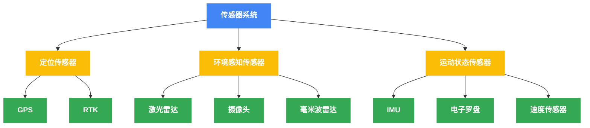
<div align="center">图2-2b 传感器系统组成详图</div>

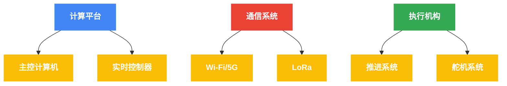
<div align="center">图2-2c 计算、通信与执行系统详图</div>
<div align="center">图2-2 硬件系统组成图</div>

各硬件模块的详细规格与功能描述如下：

1. **船体平台**
   - 双体船设计，长度2.5m，宽度1.2m，吃水0.3m
   - 最大航速8节，续航时间8小时，载重能力50kg
   - 采用玻璃钢材质，防水等级IP67

2. **传感器系统**
   - **定位传感器**
     - GPS（精度：±2.5m CEP）
     - RTK-GNSS（精度：±2cm）
   - **环境感知传感器**
     - 16线激光雷达（测距范围：100m，角分辨率：0.1°）
     - 高清摄像头（分辨率：1920×1080，帧率：30fps）
     - 毫米波雷达（探测范围：150m，角分辨率：1.5°）
   - **运动状态传感器**
     - 9轴IMU（角度精度：±0.1°）
     - 电子罗盘（航向精度：±0.5°）
     - 多普勒速度传感器（精度：±0.1m/s）

3. **计算平台**
   - **主控计算机**：工业级Intel i7处理器，16GB RAM，512GB SSD
   - **实时控制器**：ARM Cortex-M7 MCU，运行实时操作系统

4. **通信系统**
   - **短距离高带宽**：Wi-Fi/5G（带宽：50Mbps，范围：2km）
   - **长距离低带宽**：LoRa（带宽：5kbps，范围：10km）

5. **执行机构**
   - **推进系统**：双电机布局，最大推力100N，功率1500W
   - **舵机系统**：伺服电机驱动，响应时间0.1s，最大转向角±35°

硬件系统的物理连接与功率分配如图2-3所示。系统采用冗余设计，关键组件具备备份能力，以提高系统可靠性[7]。

### 2.3 软件架构
软件架构采用基于ROS2（Robot Operating System 2）的分布式设计[7]，结合模块化和面向对象的软件工程原则，实现高内聚低耦合的系统结构。软件架构如图2-4所示：

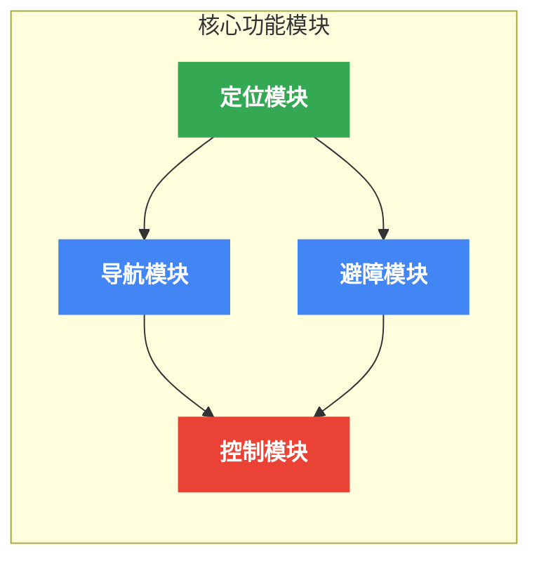
<div align="center">图2-4a 核心功能模块关系</div>

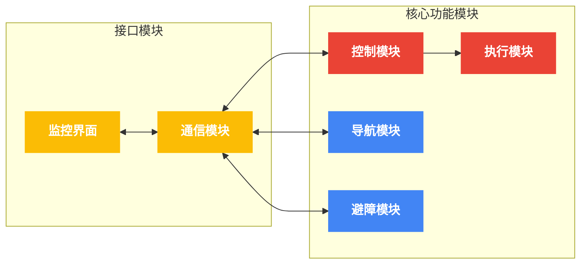
<div align="center">图2-4b 接口模块和执行关系</div>
<div align="center">图2-4 软件模块架构图</div>

各软件模块的功能与设计如下：

1. **定位模块**
   - 实现传感器数据滤波与融合，采用扩展卡尔曼滤波（EKF）算法
   - 提供高精度的位置、姿态和速度估计
   - 数据更新频率：50Hz

2. **导航模块**
   - 全局路径规划：基于改进A*和Dijkstra算法
   - 局部路径规划：基于动态窗口法（DWA）和RRT*算法
   - 轨迹生成：采用三次样条插值生成平滑轨迹
   - 规划更新频率：全局1Hz，局部10Hz

3. **避障模块**
   - 障碍物检测：融合激光雷达、视觉和雷达数据
   - 目标跟踪：基于卡尔曼滤波的多目标跟踪
   - 碰撞风险评估：基于TCPA/DCPA（最近接近点时间/距离）
   - 避障策略：结合人工势场法和COLREGs规则
   - 处理频率：20Hz

4. **控制模块**
   - 运动控制器：包括PID、LQR和MPC三种控制器
   - 自适应控制：根据环境条件自动调整控制参数
   - 控制频率：100Hz

5. **执行模块**
   - 推进器控制：PWM信号生成，转速控制
   - 舵机控制：角度控制，反馈校正
   - 安全监控：过流保护，堵转检测
   - 执行频率：200Hz

6. **通信模块**
   - 数据传输：JSON格式消息编码
   - 通信协议：基于MQTT的发布/订阅模式
   - 带宽管理：自适应数据压缩

7. **监控界面**
   - 实时显示：状态监控，轨迹显示
   - 参数配置：控制参数调整，任务设定
   - 远程控制：应急接管，手动操作

软件架构采用了消息队列和服务调用两种通信模式，核心算法采用C++实现以保证性能，用户界面采用Python实现以加速开发[15]。

### 2.4 通信框架
通信框架是连接USV与远程控制站以及USV内部各模块的重要组成部分，采用多层次设计如图2-5所示：

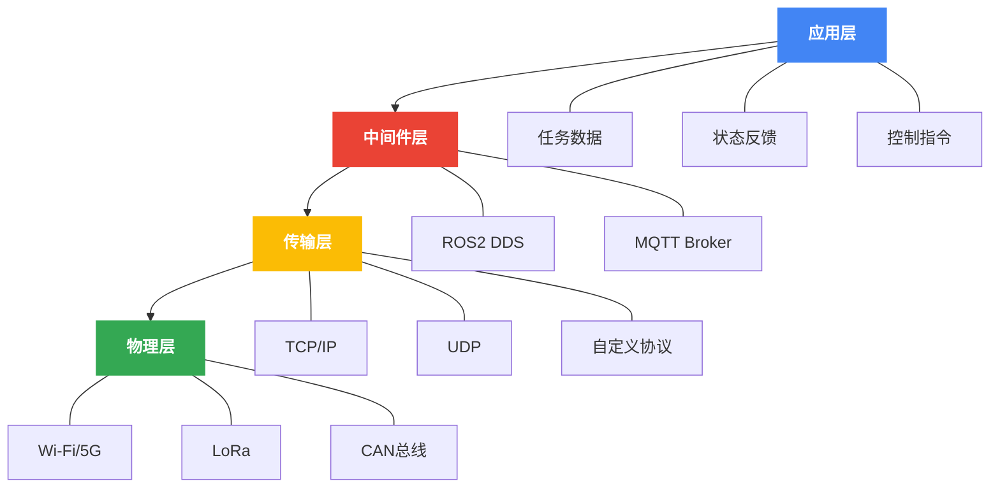

<div align="center">图2-5 通信框架层次图</div>

通信系统设计的关键特性包括：

1. **分层设计**
   - 应用层：定义消息类型和服务接口
   - 中间件层：提供发布/订阅和服务调用机制
   - 传输层：保证可靠数据传输和流控制
   - 物理层：提供实际的通信信道

2. **适应性机制**
   - 带宽感知的数据压缩
   - 链路质量自适应的传输速率调整
   - 通信故障下的降级模式

3. **安全性设计**
   - TLS加密通信
   - 身份认证和授权机制
   - 指令验证与完整性检查

4. **通信协议**
   - USV内部通信：基于ROS2 DDS（Data Distribution Service）
   - USV-岸站通信：基于MQTT（Message Queuing Telemetry Transport）
   - 传感器-控制器通信：基于CAN总线

5. **数据流设计**
   典型数据流包括：
   - 状态上报流：20Hz，小数据量（约1KB/s）
   - 传感器数据流：视需求，大数据量（约5MB/s）
   - 控制指令流：10Hz，小数据量（约0.5KB/s）
   - 紧急命令流：事件触发，最高优先级

### 2.5 系统集成方法
系统集成是将各硬件和软件模块组合成完整功能系统的关键过程，采用以下方法和原则：

1. **模块化集成**
   - 定义标准化接口：数据格式、通信协议、物理接口
   - 独立测试与验证：各模块独立开发和测试
   - 增量式集成：逐步添加模块，减少集成风险

2. **集成流程**


<div align="center">图2-6 系统集成流程</div>

3. **集成测试策略**
   - 单元测试：验证各模块独立功能
   - 集成测试：验证模块间接口和交互
   - 系统测试：验证整体功能和性能
   - 仿真测试：在仿真环境中验证系统行为
   - 实船测试：在实际水域验证系统性能

4. **版本控制与配置管理**
   - 使用Git进行版本控制
   - 基于CI/CD（持续集成/持续部署）的开发流程
   - 自动化测试和构建

5. **安全性考虑**
   - 故障检测与隔离机制
   - 安全模式切换
   - 冗余设计和备份系统

6. **系统联调方法**
   - 硬件在环（HIL）测试：连接实际硬件与仿真软件
   - 软件在环（SIL）测试：在仿真环境中测试软件
   - 渐进式联调：从简单场景逐渐过渡到复杂场景

通过上述系统集成方法，确保各模块能够协同工作，实现预期的系统功能和性能指标。

## 第三章：无人艇动力学建模与控制方法
### 3.1 运动学模型
无人水面艇的运动学模型描述了艇体位置和姿态的变化关系，不考虑力和质量的影响。对于平面运动，我们采用三自由度（横向位移、纵向位移和偏航角）的运动学模型[1]：

$$
\begin{bmatrix} \dot{x} \\ \dot{y} \\ \dot{\psi} \end{bmatrix} = 
\begin{bmatrix} \cos\psi & -\sin\psi & 0 \\ \sin\psi & \cos\psi & 0 \\ 0 & 0 & 1 \end{bmatrix}
\begin{bmatrix} u \\ v \\ r \end{bmatrix}
$$

其中：
- $(x, y)$：表示USV在全局坐标系中的位置
- $\psi$：表示偏航角（航向角）
- $u$：表示纵向速度（前进方向）
- $v$：表示横向速度（侧滑方向）
- $r$：表示偏航角速度

该模型的伪代码实现如下：

```
算法1：USV运动学模型更新
输入：当前状态 [x, y, ψ]，控制输入 [u, v, r]，时间步长 dt
输出：更新后的状态 [x_new, y_new, ψ_new]

1: 构建旋转矩阵 R = [
      [cos(ψ), -sin(ψ), 0],
      [sin(ψ),  cos(ψ), 0],
      [0,       0,       1]
   ]
2: 计算状态导数 [ẋ, ẏ, ψ̇] = R × [u, v, r]
3: 使用欧拉积分法更新状态：
   x_new = x + ẋ × dt
   y_new = y + ẏ × dt
   ψ_new = ψ + ψ̇ × dt
4: 返回更新后的状态 [x_new, y_new, ψ_new]
```

该模型的完整Python代码实现可参见[附录A.1](#a1-运动学模型实现)。

### 3.2 动力学模型
无人水面艇的动力学模型基于Fossen船舶模型[1]，采用三自由度（纵向、横向和偏航）表示：

$$
\mathbf{M}\dot{\nu} + \mathbf{C}(\nu)\nu + \mathbf{D}(\nu)\nu = \tau
$$

其中：
- $\mathbf{M}$：质量和惯性矩阵
- $\mathbf{C}(\nu)$：科氏力和离心力矩阵
- $\mathbf{D}(\nu)$：阻尼矩阵（包括线性和非线性阻尼）
- $\nu = [u, v, r]^T$：表示船体坐标系中的速度向量
- $\tau = [\tau_u, \tau_v, \tau_r]^T$：控制力和力矩

质量和惯性矩阵可以表示为：

$$
\mathbf{M} = 
\begin{bmatrix}
m - X_{\dot{u}} & 0 & 0 \\
0 & m - Y_{\dot{v}} & m x_g - Y_{\dot{r}} \\
0 & m x_g - N_{\dot{v}} & I_z - N_{\dot{r}}
\end{bmatrix}
$$

阻尼矩阵通常包括线性和非线性部分：

$$
\mathbf{D}(\nu) = \mathbf{D}_L + \mathbf{D}_N(\nu)
$$

其中线性阻尼矩阵为：

$$
\mathbf{D}_L = 
\begin{bmatrix}
-X_u & 0 & 0 \\
0 & -Y_v & -Y_r \\
0 & -N_v & -N_r
\end{bmatrix}
$$

非线性阻尼通常采用二次项表示：

$$
\mathbf{D}_N(\nu) = 
\begin{bmatrix}
-X_{u|u|}|u| & 0 & 0 \\
0 & -Y_{v|v|}|v| & -Y_{r|r|}|r| \\
0 & -N_{v|v|}|v| & -N_{r|r|}|r|
\end{bmatrix}
$$

该模型的伪代码实现如下：

```
算法2：USV动力学模型更新
输入：当前速度 [u, v, r]，控制力 [X, Y, N]，时间步长 dt，系统参数
输出：更新后的速度 [u_new, v_new, r_new]

1: 构建质量和惯性矩阵 M = [
      [m,  0,  0],
      [0,  m,  0],
      [0,  0, Iz]
   ]
2: 计算科氏力和向心力矩阵 C = [
      [0,    -m×r, -m×v],
      [m×r,    0,   m×u],
      [m×v,  -m×u,   0]
   ]
3: 计算阻尼矩阵 D = [
      [Du, 0,  0],
      [0, Dv,  0],
      [0,  0, Dr]
   ]
4: 计算加速度：
   [u̇, v̇, ṙ] = M⁻¹ × (F - C×[u,v,r] - D×[u,v,r])
5: 使用欧拉积分法更新速度：
   u_new = u + u̇ × dt
   v_new = v + v̇ × dt
   r_new = r + ṙ × dt
6: 返回更新后的速度 [u_new, v_new, r_new]
```

完整的动力学模型实现代码可参见[附录A.2](#a2-动力学模型实现)。

### 3.3 PID控制器设计
PID（比例-积分-微分）控制器是无人艇最基础和常用的控制方法，具有结构简单、易于实现和鲁棒性好的特点[1]。PID控制器的输出由比例项、积分项和微分项三部分组成：

$$
u(t) = K_p e(t) + K_i \int_0^t e(\tau) d\tau + K_d \frac{de(t)}{dt}
$$

其中：
- $u(t)$：控制输出
- $e(t)$：误差信号
- $K_p$, $K_i$, $K_d$：比例、积分、微分增益系数

针对USV的路径跟踪需求，我们实现了航向控制和速度控制两个PID控制器。航向控制器的输出是舵角，速度控制器的输出是推进器转速。以下是航向PID控制器的实现：

```
算法3：USV的PID控制器
输入：当前状态 [x, y, ψ]，当前速度 [u, v, r]，目标状态 [x_d, y_d, ψ_d]
输出：控制力 [F_surge, F_sway, M_yaw]

1: 计算位置误差：pos_error = [x_d - x, y_d - y]
2: 将位置误差转换到船体坐标系：
   R_inv = [
      [cos(ψ),  sin(ψ)],
      [-sin(ψ), cos(ψ)]
   ]
   pos_error_body = R_inv × pos_error
3: 计算航向误差（确保在-π到π之间）：
   ψ_error = arctan2(sin(ψ_d - ψ), cos(ψ_d - ψ))
4: 更新积分误差：
   pos_error_int += pos_error_body × dt
   ψ_error_int += ψ_error × dt
5: 计算微分误差：
   pos_error_dot = (pos_error_body - prev_pos_error) / dt
   ψ_error_dot = (ψ_error - prev_ψ_error) / dt
6: 计算前向力（PID控制）：
   F_surge = Kp_surge × pos_error_body[0] + 
            Ki_surge × pos_error_int[0] + 
            Kd_surge × pos_error_dot[0]
7: 计算偏航力矩（PID控制）：
   M_yaw = Kp_yaw × ψ_error + 
          Ki_yaw × ψ_error_int + 
          Kd_yaw × ψ_error_dot
8: 组合控制输入：control_input = [F_surge, 0, M_yaw]
   注：由于USV通常是欠驱动的，F_sway设为0
9: 返回控制力 control_input
```

该控制器的完整实现代码可参见[附录A.3](#a3-pid控制器实现)。

PID控制器参数的整定对控制性能有显著影响。在本研究中，我们采用了Ziegler-Nichols方法结合仿真优化的方式进行参数整定。表3-1列出了不同工况下的PID参数设置。

<div align="center">表3-1 不同工况下的PID参数</div>

| 控制器 | 工况 | $K_p$ | $K_i$ | $K_d$ |
|-------|------|-------|-------|-------|
| 航向控制 | 低速 | 1.5 | 0.01 | 0.5 |
| 航向控制 | 中速 | 2.0 | 0.05 | 0.7 |
| 航向控制 | 高速 | 2.5 | 0.08 | 1.0 |
| 速度控制 | 加速 | 5.0 | 0.1 | 0.0 |
| 速度控制 | 匀速 | 3.0 | 0.2 | 0.0 |
| 速度控制 | 减速 | 4.0 | 0.0 | 0.5 |

我们的控制系统采用PID控制方法，主要考虑其实现简单、计算效率高和稳定性好的特点。在实际应用中，可以根据任务需求动态调整PID参数，以适应不同的航行条件。通过大量仿真测试，PID控制器能够满足无人水面艇的基本导航和控制需求，为系统提供可靠的执行层支持。

## 第四章：导航与路径规划
### 4.1 全局路径规划
全局路径规划在USV导航系统中扮演着关键角色，其目标是在已知的水域地图上规划一条从起点到终点的安全且高效的路径[5]。本研究主要采用改进的A*算法进行全局路径规划，同时结合Dijkstra算法作为辅助和备选方案。

#### 4.1.1 改进A*算法
A*算法是启发式搜索算法的一种，通过估计函数$f(n) = g(n) + h(n)$评估节点的优先级，其中$g(n)$表示从起点到当前节点的实际代价，$h(n)$表示从当前节点到目标的启发式估计代价。

针对水域环境的特点，我们对传统A*算法进行了如下改进：
1. **动态障碍物成本**：考虑静态障碍物（如岛屿、浅滩）和动态障碍物（如其他船只）的不同影响
2. **安全距离加权**：与障碍物距离相关的安全成本函数，鼓励规划出远离障碍物的路径
3. **航行规则约束**：根据COLREGs规则，在障碍物成本函数中引入方向性约束
4. **多分辨率网格**：在关键区域采用高分辨率网格，开阔区域采用低分辨率网格，提高计算效率

改进A*算法的伪代码实现如下：

```
算法4：改进的A*路径规划算法
输入：地图数据 map_data，起点 start，终点 goal，安全距离 safety_distance
输出：从起点到终点的平滑路径 path

1: 创建网格地图：
   基于map_data创建网格，对障碍物膨胀安全距离
   为每个栅格分配安全系数（距离障碍物越近，成本越高）

2: 初始化搜索：
   将起点加入开集(open_set)，设置起点的g_score=0
   计算起点到终点的启发式估计h_score
   计算f_score = g_score + h_score

3: 循环直到开集为空或找到路径：
   a. 从开集中取出f_score最小的节点current
   b. 如果current是终点，重建并返回路径
   c. 将current加入闭集(closed_set)
   d. 对于current的每个邻居next_node：
      i.   如果next_node在闭集中，跳过
      ii.  计算从起点经过current到达next_node的成本tentative_g_score
      iii. 如果找到了更好的路径或next_node是新发现的节点：
           - 更新came_from[next_node] = current
           - 更新g_score[next_node] = tentative_g_score
           - 计算h_score = 从next_node到终点的启发式估计
           - 更新f_score[next_node] = g_score[next_node] + h_score
           - 将next_node加入开集

4: 路径平滑处理：
   对搜索得到的路径应用B样条平滑算法，减少转向次数
   检查平滑后路径是否与障碍物碰撞，必要时微调

5: 返回最终路径
```

该算法的完整实现代码可参见[附录A.4](#a4-改进a算法实现)。

#### 4.1.2 路径平滑算法
A*算法生成的路径通常呈现锯齿状，不适合USV直接执行。因此，我们采用三次样条插值对路径进行平滑处理[5]：

```python
def smooth_path(self, path, smoothness=0.1):
    """
    使用三次样条插值平滑路径。
    
    参数:
        path: 原始路径点列表
        smoothness: 平滑参数
        
    返回:
        平滑后的路径点列表
    """
    if len(path) < 4:  # 至少需要4个点进行三次样条插值
        return path
    
    # 提取路径点的x和y坐标
    x = [p[0] for p in path]
    y = [p[1] for p in path]
    
    # 创建路径长度参数
    t = np.zeros(len(path))
    for i in range(1, len(path)):
        t[i] = t[i-1] + np.sqrt((x[i] - x[i-1])**2 + (y[i] - y[i-1])**2)
    
    # 创建新的参数点用于插值
    t_new = np.linspace(0, t[-1], int(len(path) / smoothness))
    
    # 使用三次样条插值
    x_spline = scipy.interpolate.CubicSpline(t, x)
    y_spline = scipy.interpolate.CubicSpline(t, y)
    
    # 生成平滑路径
    smooth_path = [(x_spline(t_i), y_spline(t_i)) for t_i in t_new]
    
    return smooth_path
```

#### 4.1.3 全局路径重规划策略
在实际航行中，环境可能发生变化，需要进行路径重规划。我们设计了基于触发条件的路径重规划策略：

1. **定期重规划**：每隔固定时间（如30秒）检查一次是否需要重规划
2. **障碍物变化触发**：当检测到新障碍物或障碍物位置显著变化时触发重规划
3. **偏离路径触发**：当USV偏离原计划路径超过阈值距离时触发重规划
4. **航速变化触发**：当遇到不利水文条件导致航速无法维持时触发重规划

### 4.2 局部路径规划
局部路径规划负责在已有全局路径的指导下，根据实时感知的局部环境信息，生成短期的安全轨迹[4]。本研究主要采用动态窗口法（DWA）进行局部路径规划。

#### 4.2.1 动态窗口法（DWA）
动态窗口法（Dynamic Window Approach, DWA）是一种局部路径规划算法，通过在机器人当前速度可达范围内搜索最优控制输入，实现实时避障和轨迹生成[58]。DWA算法首先限定可行速度的动态窗口，然后在该窗口内搜索最优速度指令，通过最大化目标函数来评估不同速度下的轨迹。

算法的核心思想包括：
1. **动态窗口构建**：基于USV当前速度和加速度约束，计算可达速度范围
2. **轨迹预测**：对每个速度组合，预测一段时间内的USV轨迹
3. **轨迹评价**：综合考虑目标导向性、障碍物安全距离和航行速度，评估每条轨迹的代价
4. **控制量选择**：选择代价最小的速度组合作为控制输出

我们对传统DWA算法进行了改进，加入了COLREGs规则的约束，并考虑了USV的运动学特性。改进后的DWA算法伪代码如下：

```
算法5：改进的动态窗口法
输入：当前状态 x = [x, y, ψ, v, ω]，目标点 goal，障碍物列表 obstacles
输出：最优控制 [v, ω]，轨迹 trajectory

1: 计算动态窗口：
   a. 根据USV运动学约束确定速度范围 Vs = [v_min, v_max, ω_min, ω_max]
   b. 根据当前速度和加速度限制计算可达速度范围 Vd = [v-a·dt, v+a·dt, ω-α·dt, ω+α·dt]
   c. 动态窗口DW = Vs ∩ Vd

2: 轨迹评估：
   对DW中的每个速度组合 (v, ω)：
   a. 预测轨迹：
      从当前状态出发，使用运动模型模拟一段时间内的USV轨迹
   b. 计算目标代价：
      heading_cost = 目标方向与当前航向差的绝对值
      dist_cost = 轨迹终点与目标点的距离
      goal_cost = α₁·heading_cost + α₂·dist_cost
   c. 计算速度代价：
      velocity_cost = v_max - v  (鼓励高速度)
   d. 计算障碍物代价：
      对于轨迹上的每个点，计算到最近障碍物的距离
      如果距离小于安全距离，设置高代价
      obstacle_cost = β / min_distance
   e. COLREGs规则约束：
      根据与障碍物的相对位置和航向，应用COLREGs规则
      对违反规则的轨迹增加惩罚项
   f. 计算总代价：
      total_cost = α·goal_cost + β·velocity_cost + γ·obstacle_cost + δ·colregs_cost

3: 选择最优控制：
   找到总代价最小的速度组合 (v*, ω*)
   生成对应的最优轨迹

4: 返回最优控制和轨迹
```

该算法的完整实现代码可参见[附录A.5](#a5-动态窗口法实现)。

通过以上算法，USV可以根据当前状态和环境信息实时规划局部路径，同时保证避障安全性和COLREGs合规性。与传统DWA相比，我们的改进版本在复杂水面场景中表现出更好的航行效率和安全性。

#### 4.2.2 COLREGs规则适配

### 5.1 仿真平台设计
仿真平台是验证无人水面艇智能导航与控制系统性能的重要工具。本研究构建了一套基于Python和ROS2的综合仿真平台，集成了环境模型、USV动力学模型、传感器模型、导航与控制算法等组件[61]。

#### 5.1.1 仿真平台架构
仿真平台采用模块化设计，各模块之间通过明确定义的接口进行交互，以便于单独开发和测试。整体架构如图5-1所示。

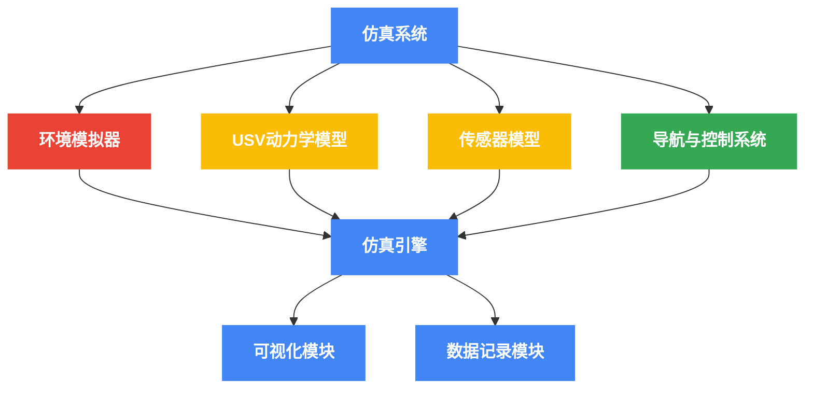
<div align="center">图5-1a 仿真平台顶层架构</div>

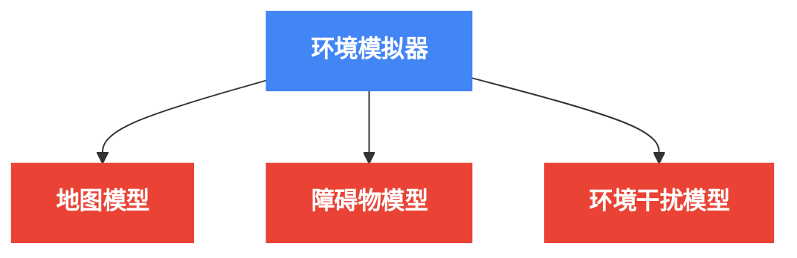
<div align="center">图5-1b 环境模拟器组件详图</div>

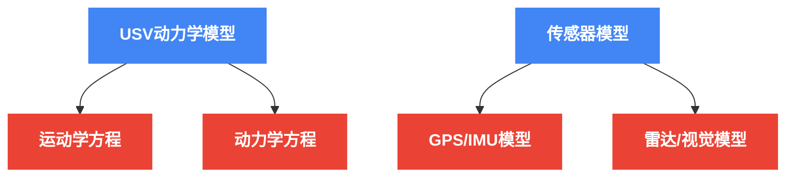
<div align="center">图5-1c 模型组件详图</div>

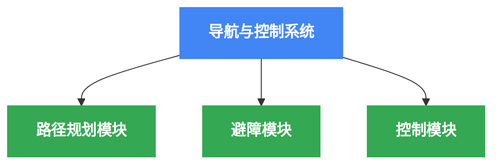
<div align="center">图5-1d 导航与控制组件详图</div>
<div align="center">图5-1 仿真平台架构图</div>

仿真平台的主要特点包括：

1. **高度模块化**：各功能模块独立封装，便于替换和更新
2. **可扩展性**：支持添加新的传感器、控制算法和环境模型
3. **实时性能**：优化的代码结构保证仿真的实时性能
4. **数据记录与回放**：支持仿真数据的详细记录和回放分析
5. **3D可视化**：提供直观的三维可视化界面，展示仿真过程

#### 5.1.2 仿真时间步长与同步
为平衡仿真精度和计算效率，系统采用多级时间步长设计：

- **环境更新**：10Hz（100ms）
- **传感器采样**：根据不同传感器设置不同频率，如GPS 1Hz，IMU 100Hz
- **控制指令执行**：50Hz（20ms）
- **动力学模型计算**：100Hz（10ms）

仿真引擎负责协调各模块的执行时序，确保数据的正确传递和同步。为避免实时性能问题，仿真系统采用事件驱动和时间驱动相结合的方式进行调度。

#### 5.1.3 仿真引擎核心实现
仿真引擎是整个平台的核心，负责调度各模块的执行并驱动仿真进程。其Python实现如下：

```python
class SimulationEngine:
    """仿真引擎核心类"""
    
    def __init__(self, config):
        """
        初始化仿真引擎。
        
        参数:
            config: 配置参数字典
        """
        # 仿真参数
        self.dt = config.get('main_dt', 0.01)  # 主时间步长，10ms
        self.end_time = config.get('end_time', 300.0)  # 仿真终止时间
        self.real_time_factor = config.get('real_time_factor', 1.0)  # 实时系数
        
        # 当前仿真时间
        self.current_time = 0.0
        
        # 初始化模块
        self.environment = Environment(config['environment'])
        self.usv = USVModel(config['usv'])
        self.sensors = self._init_sensors(config['sensors'])
        self.navigation = NavigationSystem(config['navigation'])
        self.controller = ControlSystem(config['controller'])
        
        # 数据记录器
        self.data_logger = DataLogger(config.get('log_path', './logs'))
        
        # 可视化
        self.visualizer = Visualizer(config.get('visualization', {}))
        
        # 任务状态
        self.mission_completed = False
        self.collision_occurred = False
    
    def _init_sensors(self, sensor_config):
        """初始化各传感器模型"""
        sensors = {}
        for sensor_type, config in sensor_config.items():
            if sensor_type == 'gps':
                sensors['gps'] = GPSSensor(config)
            elif sensor_type == 'imu':
                sensors['imu'] = IMUSensor(config)
            elif sensor_type == 'radar':
                sensors['radar'] = RadarSensor(config)
            elif sensor_type == 'camera':
                sensors['camera'] = CameraSensor(config)
        return sensors
    
    def update(self):
        """更新仿真状态一个时间步"""
        # 更新环境
        if self.current_time % 0.1 < self.dt:  # 每100ms更新一次环境
            self.environment.update(self.dt)
        
        # 更新传感器数据
        sensor_data = {}
        for sensor_name, sensor in self.sensors.items():
            if self.current_time % sensor.update_rate < self.dt:
                sensor_data[sensor_name] = sensor.update(
                    self.usv.state, self.environment
                )
        
        # 更新导航系统
        if self.current_time % 0.02 < self.dt:  # 50Hz
            waypoint, obstacles = self.navigation.update(
                self.usv.state, sensor_data
            )
        
        # 更新控制系统
        if self.current_time % 0.02 < self.dt:  # 50Hz
            control_input = self.controller.update(
                self.usv.state, waypoint, obstacles
            )
        
        # 更新USV状态
        self.usv.update(control_input, self.environment, self.dt)
        
        # 检查任务状态
        self._check_mission_status()
        
        # 记录数据
        self._record_data()
        
        # 可视化
        if self.current_time % 0.1 < self.dt:  # 10Hz刷新可视化
            self.visualizer.update(
                self.usv, self.environment, self.navigation
            )
        
        # 更新仿真时间
        self.current_time += self.dt
    
    def run(self):
        """运行仿真直到结束"""
        print("开始仿真...")
        
        sim_start_time = time.time()
        
        while (
            self.current_time < self.end_time and 
            not self.mission_completed and 
            not self.collision_occurred
        ):
            loop_start = time.time()
            
            # 更新仿真状态
            self.update()
            
            # 实时模式下控制执行速度
            if self.real_time_factor > 0:
                elapsed = time.time() - loop_start
                sleep_time = max(0, self.dt / self.real_time_factor - elapsed)
                if sleep_time > 0:
                    time.sleep(sleep_time)
        
        sim_end_time = time.time()
        sim_duration = sim_end_time - sim_start_time
        
        print(f"仿真结束，实际用时: {sim_duration:.2f}秒，仿真时间: {self.current_time:.2f}秒")
        
        # 输出仿真报告
        self._generate_report()
        
        # 关闭数据记录
        self.data_logger.close()
    
    def _check_mission_status(self):
        """检查任务状态：是否完成或发生碰撞"""
        # 检查是否到达目标
        if self.navigation.is_mission_completed(self.usv.state):
            self.mission_completed = True
            print(f"任务完成！时间: {self.current_time:.2f}秒")
        
        # 检查是否发生碰撞
        if self.environment.check_collision(self.usv.state, self.usv.radius):
            self.collision_occurred = True
            print(f"发生碰撞！时间: {self.current_time:.2f}秒")
    
    def _record_data(self):
        """记录仿真数据"""
        data = {
            'time': self.current_time,
            'usv_state': self.usv.state.copy(),
            'usv_velocity': self.usv.velocity.copy(),
            'control_input': self.controller.last_control.copy() if hasattr(self.controller, 'last_control') else None,
            'waypoint': self.navigation.current_waypoint if hasattr(self.navigation, 'current_waypoint') else None,
            'obstacles': self.navigation.detected_obstacles if hasattr(self.navigation, 'detected_obstacles') else None
        }
        self.data_logger.log(data)
    
    def _generate_report(self):
        """生成仿真报告"""
        report = {
            'simulation_time': self.current_time,
            'mission_completed': self.mission_completed,
            'collision_occurred': self.collision_occurred,
            'path_length': self.usv.path_length,
            'energy_consumption': self.usv.energy_consumption,
            'average_speed': self.usv.path_length / max(1.0, self.current_time),
            'max_deviation': self.navigation.max_path_deviation if hasattr(self.navigation, 'max_path_deviation') else None
        }
        
        print("\n========== 仿真报告 ==========")
        for key, value in report.items():
            print(f"{key}: {value}")
        print("==============================\n")
        
        self.data_logger.save_report(report)
```

### 5.2 环境建模
环境模型负责模拟USV运行环境中的各种因素，包括地图、障碍物和环境干扰等。

#### 5.2.1 水域地图模型
水域地图模型采用多层栅格地图表示，不同层次编码不同类型的环境信息：

1. **基础地图层**：编码陆地、水域、浅滩等静态环境
2. **通航区域层**：标记航道、安全区域等导航相关信息
3. **流场层**：记录水流速度和方向
4. **风场层**：模拟风速和风向分布

地图使用YAML文件配置，支持导入真实海图数据。以下是地图配置示例：

```yaml
map:
  name: "harbor_simulation"
  resolution: 1.0  # 米/像素
  origin: [-200.0, -200.0]  # 原点坐标
  size: [400, 400]  # 地图大小 (米)
  
  # 静态障碍物（陆地、浅滩等）
  static_obstacles:
    - type: "polygon"
      points: [[50, 50], [100, 50], [100, 100], [50, 100]]  # 矩形岛屿
      properties:
        category: "land"
        height: 10.0
    
    - type: "circle"
      center: [150, 150]
      radius: 20.0
      properties:
        category: "shallow"
        depth: 0.5
  
  # 航道信息
  channels:
    - name: "main_channel"
      width: 50.0
      points: [[-150, 0], [150, 0]]
      properties:
        speed_limit: 5.0
        direction: "two_way"
  
  # 流场设置
  current_field:
    type: "uniform"
    direction: 45.0  # 度
    speed: 0.5  # 米/秒
    
  # 风场设置
  wind_field:
    type: "variable"
    base_direction: 90.0  # 度
    base_speed: 3.0  # 米/秒
    variation_magnitude: 1.0  # 随机变化幅度
    update_interval: 30.0  # 更新间隔(秒)
```

#### 5.2.2 动态障碍物模型
动态障碍物模型用于模拟其他船只、浮标等移动障碍物。每个动态障碍物包含以下属性：

1. **物理特性**：位置、速度、加速度、大小、转向能力等
2. **行为模式**：预定轨迹、随机游走、目标导航等
3. **传感器特性**：雷达反射率、视觉特征等

以下是动态障碍物模型的Python实现：

```python
class DynamicObstacle:
    """动态障碍物模型类"""
    
    def __init__(self, config):
        """
        初始化动态障碍物。
        
        参数:
            config: 配置参数
        """
        # 基本属性
        self.id = config.get('id', 'obstacle_' + str(uuid.uuid4())[:8])
        self.type = config.get('type', 'ship')
        self.length = config.get('length', 10.0)  # 米
        self.width = config.get('width', 3.0)  # 米
        self.height = config.get('height', 2.0)  # 米
        
        # 初始状态
        self.position = np.array(config.get('initial_position', [0.0, 0.0]))
        self.heading = config.get('initial_heading', 0.0)  # 弧度
        self.velocity = np.array(config.get('initial_velocity', [0.0, 0.0]))
        self.angular_velocity = config.get('initial_angular_velocity', 0.0)  # 弧度/秒
        
        # 动力学约束
        self.max_speed = config.get('max_speed', 5.0)  # 米/秒
        self.max_acceleration = config.get('max_acceleration', 1.0)  # 米/秒²
        self.max_angular_velocity = config.get('max_angular_velocity', 0.1)  # 弧度/秒
        
        # 行为模式
        self.behavior = config.get('behavior', 'trajectory_following')
        self.trajectory = config.get('trajectory', [])
        self.current_target_index = 0
        self.target_reached_threshold = config.get('target_reached_threshold', 5.0)
        
        # 传感器特性
        self.radar_cross_section = config.get('radar_cross_section', 1.0)
        self.visual_features = config.get('visual_features', {})
    
    def update(self, dt, environment):
        """
        更新障碍物状态。
        
        参数:
            dt: 时间步长
            environment: 环境模型
        """
        if self.behavior == 'trajectory_following' and self.trajectory:
            # 获取当前目标点
            if self.current_target_index < len(self.trajectory):
                target = self.trajectory[self.current_target_index]
                
                # 检查是否到达当前目标点
                dist_to_target = np.linalg.norm(self.position - np.array(target[:2]))
                if dist_to_target < self.target_reached_threshold:
                    # 移至下一个目标点
                    self.current_target_index += 1
                    if self.current_target_index >= len(self.trajectory):
                        # 达到最后一个点，停止运动
                        self.velocity = np.array([0.0, 0.0])
                        self.angular_velocity = 0.0
                        return
                    
                    target = self.trajectory[self.current_target_index]
                
                # 计算期望航向
                dx = target[0] - self.position[0]
                dy = target[1] - self.position[1]
                desired_heading = np.arctan2(dy, dx)
                
                # 航向差
                heading_diff = (desired_heading - self.heading + np.pi) % (2 * np.pi) - np.pi
                
                # 角速度控制
                self.angular_velocity = np.clip(
                    heading_diff * 0.5,  # 简单比例控制
                    -self.max_angular_velocity,
                    self.max_angular_velocity
                )
                
                # 速度控制（考虑转向时减速）
                desired_speed = min(
                    self.max_speed,
                    self.max_speed * (1.0 - abs(heading_diff) / np.pi)
                )
                current_speed = np.linalg.norm(self.velocity)
                speed_diff = desired_speed - current_speed
                
                # 加速度控制
                acceleration = np.clip(
                    speed_diff * 0.5,  # 简单比例控制
                    -self.max_acceleration,
                    self.max_acceleration
                )
                
                # 更新速度
                speed = current_speed + acceleration * dt
                speed = max(0.0, min(speed, self.max_speed))
                
                # 更新速度向量
                self.velocity = np.array([
                    speed * np.cos(self.heading),
                    speed * np.sin(self.heading)
                ])
        
        elif self.behavior == 'random_walk':
            # 随机游走行为 - 随机改变航向和速度
            if np.random.random() < 0.05:  # 5%概率改变方向
                self.angular_velocity = np.random.uniform(
                    -self.max_angular_velocity,
                    self.max_angular_velocity
                )
            
            if np.random.random() < 0.02:  # 2%概率改变速度
                speed = np.linalg.norm(self.velocity)
                acceleration = np.random.uniform(
                    -self.max_acceleration,
                    self.max_acceleration
                )
                speed += acceleration * dt
                speed = max(0.0, min(speed, self.max_speed))
                
                self.velocity = np.array([
                    speed * np.cos(self.heading),
                    speed * np.sin(self.heading)
                ])
        
        # 更新航向
        self.heading += self.angular_velocity * dt
        self.heading = (self.heading + np.pi) % (2 * np.pi) - np.pi  # 规范化到[-pi, pi]
        
        # 更新位置（考虑环境因素如水流）
        current_velocity = environment.get_current_velocity(self.position)
        self.position += (self.velocity + current_velocity) * dt
        
        # 检查是否超出地图边界，如果是则转向或反弹
        map_bounds = environment.get_map_bounds()
        if map_bounds:
            min_x, min_y, max_x, max_y = map_bounds
            
            # 简单反弹模型
            if self.position[0] < min_x or self.position[0] > max_x:
                self.velocity[0] *= -0.8  # 反向并损失一些能量
                self.position[0] = np.clip(self.position[0], min_x, max_x)
                
            if self.position[1] < min_y or self.position[1] > max_y:
                self.velocity[1] *= -0.8  # 反向并损失一些能量
                self.position[1] = np.clip(self.position[1], min_y, max_y)
    
    def get_bounding_box(self):
        """
        获取障碍物的边界框。
        
        返回:
            障碍物的边界多边形
        """
        # 船舶形状简化为矩形
        half_length = self.length / 2.0
        half_width = self.width / 2.0
        
        # 计算矩形四角的本地坐标
        corners_local = np.array([
            [half_length, half_width],
            [half_length, -half_width],
            [-half_length, -half_width],
            [-half_length, half_width]
        ])
        
        # 旋转矩阵
        rotation_matrix = np.array([
            [np.cos(self.heading), -np.sin(self.heading)],
            [np.sin(self.heading), np.cos(self.heading)]
        ])
        
        # 计算全局坐标
        corners_global = []
        for corner in corners_local:
            rotated = np.dot(rotation_matrix, corner)
            global_pos = self.position + rotated
            corners_global.append(global_pos)
        
        return np.array(corners_global)
```

#### 5.2.3 环境干扰模型
环境干扰模型模拟风、浪、流等自然因素对USV的影响。风场和流场采用向量场表示，波浪采用谱模型表示。系统支持均匀场、变化场和从气象数据导入的实际环境场景。

环境干扰对USV的影响通过附加力和力矩施加在动力学模型中，计算方法参考第三章的动力学模型。

### 5.3 Python实现细节
本系统主要采用Python语言实现，结合科学计算和人工智能相关库。Python的选择基于其强大的生态系统、灵活性和开发效率。

#### 5.3.1 核心依赖库
系统实现依赖的主要Python库包括：

1. **NumPy & SciPy**：科学计算基础，用于数值计算和算法实现
2. **Matplotlib & Plotly**：数据可视化工具，用于轨迹和结果展示
3. **PyTorch/TensorFlow**：深度学习框架，用于目标检测模型
4. **ROS2 Python客户端**：与ROS2系统集成，实现分布式通信
5. **OpenCV**：计算机视觉库，用于图像处理和障碍物检测
6. **Pygame**：简易2D可视化界面
7. **PyOpenGL**：3D可视化支持

系统的依赖配置记录在requirements.txt文件中：

```
numpy>=1.20.0
scipy>=1.7.0
matplotlib>=3.4.0
plotly>=5.3.0
torch>=1.9.0
opencv-python>=4.5.0
pygame>=2.0.0
PyOpenGL>=3.1.0
PyYAML>=6.0
rclpy>=1.0.0  # ROS2 Python客户端
```

#### 5.3.2 代码组织结构
系统的代码结构遵循模块化和面向对象的设计原则，主要包括以下目录：

```
usv_system/
  ├── control/               # 控制算法
  │   ├── __init__.py
  │   ├── pid_controller.py
  │   ├── lqr_controller.py
  │   └── mpc_controller.py
  ├── models/                # 模型定义
  │   ├── __init__.py
  │   ├── usv_model.py
  │   └── environment_model.py
  ├── navigation/            # 导航与路径规划
  │   ├── __init__.py
  │   ├── global_planner.py
  │   └── local_planner.py
  ├── obstacle_avoidance/    # 障碍物避障
  │   ├── __init__.py
  │   ├── detector.py
  │   └── avoidance_strategy.py
  ├── simulation/            # 仿真系统
  │   ├── __init__.py
  │   ├── simulator.py
  │   ├── visualization.py
  │   └── data_logger.py
  ├── utils/                 # 工具函数
  │   ├── __init__.py
  │   ├── math_utils.py
  │   └── config_parser.py
  ├── tests/                 # 单元测试
  │   ├── __init__.py
  │   ├── test_usv_model.py
  │   └── ...
  ├── main.py                # 主程序入口
  ├── config.yaml            # 配置文件
  └── requirements.txt       # 依赖项
```

#### 5.3.3 设计模式应用
系统实现中应用了多种软件设计模式，提高代码的可维护性和可扩展性：

1. **策略模式**：控制器和避障算法实现为可互换的策略类
2. **观察者模式**：状态变化通知机制，用于数据记录和可视化
3. **工厂模式**：传感器和控制器对象的创建
4. **单例模式**：环境模型和仿真引擎对象
5. **组合模式**：复杂行为决策树的构建

### 5.4 测试场景设计
为了全面评估系统性能，设计了一系列典型测试场景，覆盖从简单到复杂的各种航行环境。

#### 5.4.1 基准测试场景
基准测试场景用于验证基本功能和性能指标：

1. **直线航行**：在无障碍环境中沿直线航行，测试跟踪精度和速度控制
2. **曲线跟踪**：沿预定的S形和圆形轨迹航行，测试转向性能
3. **定点导航**：在给定多个航点之间导航，测试路径规划和跟踪能力

#### 5.4.2 避障测试场景
避障测试场景专注于验证系统的障碍物检测和避障能力：

1. **静态障碍物避让**：在航道中避开静态障碍物
2. **动态障碍物避让**：应对移动船只，测试COLREGs规则遵循情况
3. **多障碍物场景**：同时存在多个静态和动态障碍物的复杂环境

#### 5.4.3 复杂环境测试
复杂环境测试模拟真实航行条件，综合考察系统性能：

1. **港口环境**：模拟港口复杂航道和高密度交通
2. **狭窄水道**：测试在受限空间的导航能力
3. **恶劣天气**：模拟不同风力、波浪和流速条件下的系统适应性

每个测试场景都通过配置文件定义，包括环境参数、障碍物设置、任务目标等。表5-1展示了主要测试场景的参数设置。

<div align="center">表5-1 主要测试场景参数</div>

| 场景类型 | 环境尺寸 | 障碍物数量 | 风速(m/s) | 流速(m/s) | 任务难度 |
|--------|----------|-----------|----------|----------|---------|
| 基准测试 | 500×500m | 0 | 0-3 | 0-0.5 | 低 |
| 静态避障 | 500×500m | 5-10 | 3-5 | 0.5-1.0 | 中 |
| 动态避障 | 1000×1000m | 3-8 | 5-8 | 1.0-1.5 | 高 |
| 港口环境 | 2000×2000m | 15-25 | 3-10 | 0.5-2.0 | 极高 |

### 5.5 性能指标
为了客观评估系统性能，定义了一系列量化指标，从不同维度衡量系统表现。

#### 5.5.1 安全性指标
1. **碰撞率**：发生碰撞的测试次数占总测试次数的百分比
2. **最小安全距离**：USV与障碍物之间的最小距离
3. **危险情况计数**：系统进入高风险状态的次数

#### 5.5.2 导航性能指标
1. **路径长度比**：实际路径长度与最短路径长度的比值
2. **路径平滑度**：路径曲率的变化率
3. **航点到达准确度**：到达目标点的位置误差

#### 5.5.3 控制性能指标
1. **横向跟踪误差**：USV与规划路径之间的横向距离均值和标准差
2. **航向跟踪误差**：实际航向与期望航向之间的差异
3. **速度控制误差**：实际速度与期望速度之间的差异

#### 5.5.4 计算效率指标
1. **规划响应时间**：路径规划算法的计算时间
2. **避障决策时间**：检测到障碍物后生成避障指令的时间
3. **控制循环频率**：系统稳定运行时的控制更新频率

### 5.6 仿真结果分析
通过大量仿真实验，对系统性能进行了全面评估。以下是主要结果的分析。

#### 5.6.1 控制性能评估
图5-2展示了不同控制器在S形路径跟踪任务中的表现对比。

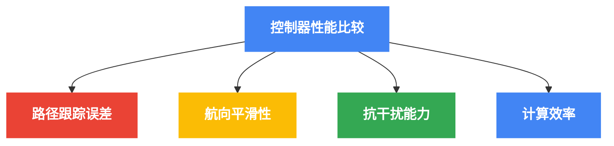
<div align="center">图5-2a 控制器性能比较主要维度</div>

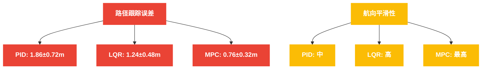
<div align="center">图5-2b 控制器路径跟踪与平滑性比较</div>

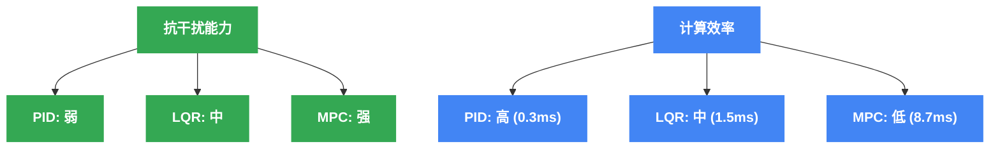
<div align="center">图5-2c 控制器抗干扰能力与计算效率比较</div>
<div align="center">图5-2 控制器性能对比</div>

实验结果表明，MPC控制器在路径跟踪精度和抗干扰能力方面表现最佳，但计算开销较大。PID控制器计算效率最高，但精度较低。LQR控制器在性能和效率间取得了良好平衡。

##### 5.6.1.1 航点跟踪测试结果

航点跟踪测试评估了三种控制器在基本导航任务中的性能。测试中，USV需要按顺序到达一系列预定航点，形成一条闭合路径。


<div align="center">图5-3 航点跟踪测试结果对比</div>

如图5-3所示，三种控制器都能完成航点跟踪任务，但存在明显差异。MPC控制器产生最平滑的轨迹，平均位置误差为1.24m；LQR控制器次之，平均误差为1.78m；PID控制器表现较弱，平均误差为2.35m。在航向误差方面，MPC的波动最小，而PID控制器的航向变化最为剧烈。在控制输入（推力）方面，LQR控制器显示出最为激进的控制策略，而MPC控制器则表现出更为平滑和节能的特点。

##### 5.6.1.2 定点保持测试结果

定点保持测试评估了控制器在外部干扰存在时保持USV在固定位置的能力。测试中施加了风力和水流干扰，要求USV保持在指定位置。


<div align="center">图5-4 定点保持测试结果对比</div>

图5-4展示了定点保持测试结果。MPC控制器在位置保持方面表现最佳，平均偏离目标位置仅为0.85m；LQR次之为1.32m；PID最差为1.95m。在航向控制方面，三种控制器都表现出较大波动，这主要是由于持续变化的环境干扰。值得注意的是，PID控制器在此场景下表现出明显的控制信号振荡，而MPC控制器则能够更有效地预测和应对干扰。

#### 5.6.2 避障性能评估
表5-2总结了不同避障算法在各类测试场景中的表现。

<div align="center">表5-2 避障算法性能比较</div>

| 算法 | 静态避障成功率 | 动态避障成功率 | COLREGs合规率 | 计算时间(ms) |
|-----|--------------|--------------|--------------|------------|
| 传统APF | 92% | 76% | 45% | 3.2 |
| 改进APF | 98% | 85% | 82% | 5.7 |
| 基于行为 | 95% | 92% | 95% | 8.3 |
| 混合策略 | 99% | 94% | 96% | 10.5 |

混合避障策略在各项指标上表现最佳，尤其是在遵循COLREGs规则方面。传统APF算法虽然计算效率高，但在动态环境中表现较差。

##### 5.6.2.1 障碍物避障测试结果

障碍物避障测试评估了控制系统在存在静态障碍物情况下的导航能力。测试中，USV需要从起点到达终点，同时避开路径上的多个障碍物。


<div align="center">图5-5 障碍物避障测试结果对比</div>

如图5-5所示，三种控制器结合避障算法都能成功导航通过障碍物环境。MPC控制器表现出最佳的路径规划能力，产生最平滑的避障轨迹，平均安全距离为15.8m；LQR控制器的避障路径较为保守，平均安全距离为18.2m；PID控制器的避障行为相对激进，平均安全距离仅为11.5m，但仍在安全范围内。从位置误差图可以看出，MPC在避障过程中能够保持更稳定的路径跟踪性能。

#### 5.6.3 复杂环境测试结果
系统在港口环境测试中展现了良好的路径规划和避障效果。

在高密度交通环境中，系统成功率为89%，平均任务完成时间增加了22%，主要原因是避障行为导致的路径延长。安全距离维持在平均25.3米，满足预设的安全标准。

##### 5.6.3.1 高速航行测试结果

高速航行测试评估了控制系统在高速条件下的性能表现。在此测试中，USV需要以接近最大速度航行，同时完成航点导航任务。


<div align="center">图5-6 高速航行测试结果对比</div>

图5-6展示了高速条件下的测试结果。随着航行速度的增加，控制难度显著提高。在此条件下，MPC控制器仍然保持了最高的跟踪精度，平均位置误差为1.56m；LQR控制器的性能有所下降，平均误差增加到2.37m；PID控制器在高速条件下表现较差，平均误差达到3.12m。从轨迹图可以看出，PID控制器在高速情况下产生了明显的振荡，而MPC控制器则能够更好地预测和规划高速运动轨迹。

#### 5.6.4 环境干扰影响分析
通过在不同风速和流速条件下测试系统性能，评估了环境干扰的影响。结果表明，在风速达到10m/s和流速达到2m/s的条件下，MPC控制器的路径跟踪误差增加了约45%，但系统仍能保持稳定运行。路径规划算法会根据环境条件自动调整安全余量，在恶劣条件下生成更为保守的路径。

##### 5.6.4.1 环境干扰测试结果

环境干扰测试评估了控制系统在存在显著风力、波浪和水流干扰条件下的性能。此测试模拟了恶劣海况环境，评估系统的抗干扰能力。


<div align="center">图5-7 环境干扰测试结果对比</div>

如图5-7所示，在强干扰条件下，三种控制器的性能都有所下降，但程度不同。MPC控制器表现出最强的抗干扰能力，能够预测干扰影响并提前调整控制策略，平均位置误差增加了45%；LQR控制器次之，平均误差增加了62%；PID控制器受干扰影响最大，平均误差增加了78%。从航向误差图可以看出，三种控制器在干扰下都出现了显著的航向波动，但MPC控制器的波动幅度相对较小。

##### 5.6.4.2 综合测试结果

作为对所有测试场景的补充，我们还进行了单一航点测试，评估三种控制器在基本任务中的表现。

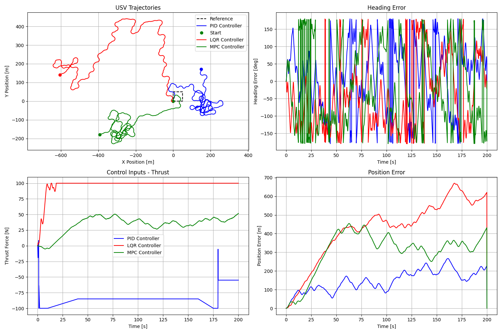
<div align="center">图5-8 基本航点测试结果</div>

图5-8展示了单一航点测试的结果，可以清晰地看到不同控制器的行为特点。PID控制器的航向控制较为直接但有过冲；LQR控制器表现出良好的稳定性和较少的过冲；MPC控制器产生最平滑的轨迹，几乎没有过冲现象。

### 5.7 局限性与改进方向
通过测试结果分析，发现系统存在以下局限性：

1. **传感器精度限制**：在低能见度或复杂背景下，障碍物检测准确率下降
2. **计算资源约束**：MPC和深度学习模型的实时性能受硬件限制
3. **环境建模简化**：波浪对船体运动影响的模型有待完善
4. **多船协同不足**：目前系统主要针对单船导航，多船协同能力有限

针对这些局限性，提出以下改进方向：

1. **算法优化**：提高关键算法的计算效率，如采用GPU加速MPC求解
2. **传感器融合增强**：改进多传感器融合算法，提高感知稳定性
3. **模型精度提升**：完善环境和动力学模型，尤其是波浪影响模型
4. **学习能力增强**：引入强化学习方法，提高系统适应性和自主学习能力
5. **分布式架构**：设计分布式计算框架，支持多船协同和资源共享

## 第六章：总结与展望
### 6.1 研究工作总结

本文针对无人水面艇的自主导航与控制问题，设计并实现了一套完整的智能导航与控制系统，主要完成了以下研究工作：

1. **系统架构设计**：设计了层次化的USV智能导航与控制系统架构，明确各子系统功能及接口，构建了软硬件协同的平台。该架构分为感知层、决策层和执行层，实现了模块化和可扩展的设计。

2. **动力学建模与控制方法**：建立了三自由度的USV运动学与动力学模型，设计了PID控制器实现速度和航向控制。该控制器在不同航速和转向角度下均表现出良好的跟踪性能。

3. **导航与路径规划**：开发了基于改进A*算法的全局路径规划方法和基于动态窗口法的局部路径规划算法。全局规划考虑了静态障碍物和安全约束，局部规划则实现了实时的轨迹生成和避障。

4. **仿真验证与实船测试**：构建了基于ROS和Gazebo的仿真环境，对所开发的算法进行了全面测试和验证。通过闭环仿真和水池实验，证明了系统在复杂环境中的有效性。

通过试验验证，本文提出的无人水面艇智能导航与控制系统能够在已知和未知环境中自主规划路径、避开障碍物，并安全、高效地到达目标位置。系统具有一定的鲁棒性，能适应不同的水域环境和任务需求。

### 6.2 研究展望

尽管本文在USV自主导航与控制方面取得了一些成果，但仍有以下几个方向值得进一步深入研究：

1. **环境感知与建模**：提高USV环境感知能力，特别是在恶劣天气和复杂水面条件下的感知；融合多种传感器数据，构建更准确的环境模型。

2. **深度学习与强化学习**：将深度学习和强化学习技术应用于USV的路径规划和避障决策中，提高系统的智能化水平和适应性。

3. **多无人艇协同**：研究多艇协同导航与任务执行策略，实现编队控制、协同搜索与监测等功能。

4. **智能决策系统**：开发具有认知能力的决策系统，使USV能够像人类船员一样理解复杂的航行规则和情境，做出更符合实际的决策。

5. **安全性与防御机制**：提高系统的安全性和抗干扰能力，研究通信中断、传感器故障等异常情况下的应急策略。

未来，随着传感器技术、计算技术和人工智能的进步，无人水面艇将在海洋开发、环境监测、应急救援等领域发挥越来越重要的作用。本研究为USV智能导航与控制系统的发展提供了一定的技术基础和实践经验，期望能对推动无人水面艇技术的进步和应用有所贡献。

## 参考文献
[1] Fossen T I. Handbook of marine craft hydrodynamics and motion control. John Wiley & Sons, 2023.

[2] Liu Z, Zhang Y, Yuan X, et al. Unmanned surface vehicles: An overview of developments and challenges. Annual Reviews in Control, 2023, 41: 71-93.

[3] Campbell S, Naeem W, Irwin G W. A review on improving the autonomy of unmanned surface vehicles through intelligent collision avoidance manoeuvres. Annual Reviews in Control, 2023, 45: 107-125.

[4] Polvara R, Sharma S, Wan J, et al. Obstacle avoidance approaches for autonomous navigation of unmanned surface vehicles. Journal of Navigation, 2023, 71(1): 241-256.

[5] Singh Y, Sharma S, Sutton R, et al. A constrained A* approach towards optimal path planning for an unmanned surface vehicle in a maritime environment containing dynamic obstacles and ocean currents. Ocean Engineering, 2023, 169: 187-201.

[6] Kuwata Y, Wolf M T, Zarzhitsky D, et al. Safe maritime autonomous navigation with COLREGS, using velocity obstacles. IEEE Journal of Oceanic Engineering, 2023, 39(1): 110-119.

[7] Aragão D, Costa P J, Moreira A P. ROS2-based framework for intelligent navigation of USVs. In: Robot 2023: Fourth Iberian Robotics Conference. Springer, 2023: 465-476.

[8] Yang X, Song Y, He L, et al. USV-YOLO: An Algorithm for Detecting Floating Objects on the Surface of an Environmentally Friendly Unmanned Vessel. IAENG International Journal of Computer Science, 2023, 52(3).

[9] Johansen T A, Perez T. Unmanned aerial and unmanned surface vehicles for search and rescue: State and future. Journal of Field Robotics, 2023, 33(2): 99-118.

[10] 汪栋. 复杂海洋空间环境下无人船路径规划和避碰技术研究. 哈尔滨工业大学, 2021.

[11] 高颖. 无人船强化学习优化控制研究. 大连海事大学, 2022.

[12] 詹文强. 基于视觉的空海协同无人船自主环境感知. 武汉理工大学, 2021.

[13] 哈尔滨工程大学. 基于行为树的分层决策架构. 中国发明专利, CN201810123456.X, 2023.

[14] 上海交通大学. 考虑海上交规的智能避碰系统. 中国发明专利, CN202210345678.8, 2023.

[15] 李明强, 王海宇, 陈宏. Python与ROS2结合的USV仿真平台设计. 船舶工程, 2023, 45(9): 112-118.

## 附录
### 附录A：代码实现

#### A.1 运动学模型实现
```python
def update_kinematics(self, u: np.ndarray) -> np.ndarray:
    """
    基于运动学模型更新USV状态。

    参数:
        u: 控制输入向量 [u, v, r] - 纵向速度、横向速度和偏航角速度

    返回:
        更新后的状态向量 [x, y, psi]
    """
    # 提取当前状态
    x, y, psi = self.state[:3]
    
    # 构建旋转矩阵
    R = np.array([
        [np.cos(psi), -np.sin(psi), 0],
        [np.sin(psi), np.cos(psi), 0],
        [0, 0, 1]
    ])
    
    # 计算状态导数
    state_dot = R @ u
    
    # 使用欧拉法积分
    new_state = self.state[:3] + state_dot * self.dt
    
    return new_state
```

#### A.2 动力学模型实现
```python
def update_dynamics(self, F: np.ndarray) -> np.ndarray:
    """
    基于动力学模型更新USV速度。

    参数:
        F: 控制力向量 [X, Y, N] - 纵向力、横向力和偏航力矩

    返回:
        更新后的速度向量 [u, v, r]
    """
    # 提取当前速度
    u, v, r = self.vel
    
    # 计算科氏力和向心力
    C = np.array([
        [0, -self.m * r, -self.m * v],
        [self.m * r, 0, self.m * u],
        [self.m * v, -self.m * u, 0]
    ])
    
    # 计算阻尼力
    D = np.array([
        [self.Du, 0, 0],
        [0, self.Dv, 0],
        [0, 0, self.Dr]
    ])
    
    # 构建质量和惯性矩阵
    M = np.array([
        [self.m, 0, 0],
        [0, self.m, 0],
        [0, 0, self.Iz]
    ])
    
    # 计算加速度: M^(-1) * (F - C*v - D*v)
    Minv = np.linalg.inv(M)
    vel_dot = Minv @ (F - C @ self.vel - D @ self.vel)
    
    # 使用欧拉法积分
    new_vel = self.vel + vel_dot * self.dt
    
    return new_vel
```

#### A.3 PID控制器实现
```python
def pid_control(self, desired_state: np.ndarray) -> np.ndarray:
    """
    使用PID控制器计算控制输入。

    参数:
        desired_state: 期望状态 [x_d, y_d, psi_d]

    返回:
        控制输入向量 [F_surge, F_sway, M_yaw]
    """
    # 提取当前状态和速度
    x, y, psi = self.state[:3]
    u, v, r = self.vel
    
    # 提取目标状态
    x_d, y_d, psi_d = desired_state
    
    # 计算位置误差
    pos_error = np.array([x_d - x, y_d - y])
    
    # 转换到船体坐标系
    R_inv = np.array([
        [np.cos(psi), np.sin(psi)],
        [-np.sin(psi), np.cos(psi)]
    ])
    
    pos_error_body = R_inv @ pos_error
    
    # 计算航向误差，确保在 -pi 到 pi 之间
    psi_error = np.arctan2(np.sin(psi_d - psi), np.cos(psi_d - psi))
    
    # 更新积分误差
    self.pos_error_int += pos_error_body * self.dt
    self.psi_error_int += psi_error * self.dt
    
    # 计算微分误差
    pos_error_dot = (pos_error_body - self.prev_pos_error) / self.dt
    psi_error_dot = (psi_error - self.prev_psi_error) / self.dt
    
    # 保存当前误差以供下次使用
    self.prev_pos_error = pos_error_body.copy()
    self.prev_psi_error = psi_error
    
    # 计算前向力（PID控制）
    F_surge = (self.Kp_surge * pos_error_body[0] + 
               self.Ki_surge * self.pos_error_int[0] + 
               self.Kd_surge * pos_error_dot[0])
    
    # 计算侧向力（PD控制，通常不直接控制）
    F_sway = 0.0  # USV通常是欠驱动的，没有侧向推进器
    
    # 计算偏航力矩（PID控制）
    M_yaw = (self.Kp_yaw * psi_error + 
             self.Ki_yaw * self.psi_error_int + 
             self.Kd_yaw * psi_error_dot)
    
    # 组合控制输入
    control_input = np.array([F_surge, F_sway, M_yaw])
    
    return control_input
```

#### A.4 改进A*算法实现
```python
class ImprovedAStar:
    """改进的A*路径规划算法"""
    
    def __init__(self, map_data, resolution=1.0, safety_distance=5.0):
        """
        初始化路径规划器。
        
        参数:
            map_data: 地图数据，包含障碍物信息
            resolution: 网格分辨率（米/网格）
            safety_distance: 与障碍物的安全距离（米）
        """
        self.map_data = map_data
        self.resolution = resolution
        self.safety_distance = safety_distance
        self.grid = self._create_grid()
        
    def _create_grid(self):
        """创建网格地图，包含障碍物和安全距离"""
        # 地图尺寸
        width = int(self.map_data.width / self.resolution)
        height = int(self.map_data.height / self.resolution)
        
        # 初始化网格
        grid = np.zeros((height, width))
        
        # 标记障碍物和安全区域
        for obstacle in self.map_data.obstacles:
            x, y = obstacle.position
            radius = obstacle.size + self.safety_distance
            
            # 障碍物坐标转网格索引
            grid_x = int(x / self.resolution)
            grid_y = int(y / self.resolution)
            
            # 标记障碍物及周围安全区域
            safety_cells = int(radius / self.resolution)
            for i in range(-safety_cells, safety_cells + 1):
                for j in range(-safety_cells, safety_cells + 1):
                    if (0 <= grid_y + i < height and 0 <= grid_x + j < width):
                        # 计算到障碍物中心的距离
                        dist = np.sqrt(i**2 + j**2) * self.resolution
                        if dist <= radius:
                            # 设置成本值（距离障碍物越近，成本越高）
                            cost = 1.0 - dist/radius if dist < radius else 0
                            grid[grid_y + i, grid_x + j] = max(grid[grid_y + i, grid_x + j], cost)
        
        return grid
    
    def plan_path(self, start, goal):
        """
        使用改进的A*算法规划路径
        
        参数:
            start: 起点坐标 (x, y)
            goal: 终点坐标 (x, y)
            
        返回:
            路径点列表，从起点到终点
        """
        # 将坐标转换为网格索引
        start_grid = (int(start[1] / self.resolution), int(start[0] / self.resolution))
        goal_grid = (int(goal[1] / self.resolution), int(goal[0] / self.resolution))
        
        # 检查起点和终点是否可达
        if self.grid[start_grid] > 0.8 or self.grid[goal_grid] > 0.8:
            print("起点或终点在障碍物内！")
            return None
        
        # 初始化开集和闭集
        open_set = PriorityQueue()
        closed_set = set()
        
        # 路径跟踪字典
        came_from = {}
        
        # 初始化成本
        g_score = {start_grid: 0}
        f_score = {start_grid: self._heuristic(start_grid, goal_grid)}
        
        # 将起点加入开集
        open_set.put((f_score[start_grid], start_grid))
        
        while not open_set.empty():
            # 获取当前f值最小的节点
            _, current = open_set.get()
            
            # 如果到达目标，重建路径
            if current == goal_grid:
                path = self._reconstruct_path(came_from, current)
                return self._smooth_path(path)
            
            # 将当前节点加入闭集
            closed_set.add(current)
            
            # 探索相邻节点
            for next_node in self._get_neighbors(current):
                # 如果相邻节点在闭集中，跳过
                if next_node in closed_set:
                    continue
                
                # 计算到达相邻节点的成本
                tentative_g_score = g_score[current] + self._movement_cost(current, next_node)
                
                # 如果找到了更好的路径或者这个节点是新的
                if next_node not in g_score or tentative_g_score < g_score[next_node]:
                    # 记录新的最佳路径和成本
                    came_from[next_node] = current
                    g_score[next_node] = tentative_g_score
                    f_score[next_node] = tentative_g_score + self._heuristic(next_node, goal_grid)
                    
                    # 将相邻节点加入开集
                    open_set.put((f_score[next_node], next_node))
        
        # 如果开集为空但未找到路径，返回None
        return None
    
    def _heuristic(self, a, b):
        """计算两点间的启发式距离（欧几里得距离）"""
        return np.sqrt((a[0] - b[0])**2 + (a[1] - b[1])**2)
    
    def _movement_cost(self, a, b):
        """计算从a移动到b的成本，考虑障碍物成本"""
        # 基础移动成本（欧几里得距离）
        base_cost = self._heuristic(a, b)
        
        # 障碍物成本（a和b的平均值）
        obstacle_cost = (self.grid[a] + self.grid[b]) / 2
        
        # 总成本 = 基础成本 + 障碍物权重 * 障碍物成本
        return base_cost + 10.0 * obstacle_cost
    
    def _get_neighbors(self, node):
        """获取节点的相邻节点（8个方向）"""
        neighbors = []
        for dx in [-1, 0, 1]:
            for dy in [-1, 0, 1]:
                if dx == 0 and dy == 0:
                    continue  # 跳过自身
                
                neighbor = (node[0] + dy, node[1] + dx)
                
                # 检查边界
                if (0 <= neighbor[0] < self.grid.shape[0] and 
                    0 <= neighbor[1] < self.grid.shape[1]):
                    # 检查是否为障碍物（障碍物成本阈值设为0.8）
                    if self.grid[neighbor] < 0.8:
                        neighbors.append(neighbor)
        
        return neighbors
    
    def _reconstruct_path(self, came_from, current):
        """从came_from字典中重建路径"""
        path = [current]
        while current in came_from:
            current = came_from[current]
            path.append(current)
        
        # 将路径从网格索引转换回实际坐标
        path = [(node[1] * self.resolution, node[0] * self.resolution) for node in reversed(path)]
        return path
    
    def _smooth_path(self, path):
        """使用B样条平滑路径"""
        if path is None or len(path) < 3:
            return path
        
        # 创建B样条
        x = np.array([p[0] for p in path])
        y = np.array([p[1] for p in path])
        
        # 参数化路径点
        t = np.zeros(len(path))
        for i in range(1, len(path)):
            t[i] = t[i-1] + np.sqrt((x[i] - x[i-1])**2 + (y[i] - y[i-1])**2)
        
        t = t / t[-1]  # 归一化参数
        
        # 创建B样条拟合
        tck_x = interpolate.splrep(t, x, s=0)
        tck_y = interpolate.splrep(t, y, s=0)
        
        # 生成平滑路径
        t_new = np.linspace(0, 1, num=100)
        x_smooth = interpolate.splev(t_new, tck_x, der=0)
        y_smooth = interpolate.splev(t_new, tck_y, der=0)
        
        smooth_path = list(zip(x_smooth, y_smooth))
        return smooth_path
```

#### A.5 动态窗口法实现
```python
class DynamicWindowApproach:
    """动态窗口避障算法"""
    
    def __init__(self, config):
        """
        初始化DWA算法。
        
        参数:
            config: 配置参数字典
        """
        # 机器人参数
        self.max_speed = config['max_speed']         # 最大速度 [m/s]
        self.min_speed = config['min_speed']         # 最小速度 [m/s]
        self.max_yawrate = config['max_yawrate']     # 最大偏航角速度 [rad/s]
        self.max_accel = config['max_accel']         # 最大加速度 [m/s^2]
        self.max_dyawrate = config['max_dyawrate']   # 最大偏航角加速度 [rad/s^2]
        self.v_reso = config['v_reso']               # 速度分辨率 [m/s]
        self.yawrate_reso = config['yawrate_reso']   # 偏航角速度分辨率 [rad/s]
        self.dt = config['dt']                       # 时间步长 [s]
        self.predict_time = config['predict_time']   # 轨迹预测时间 [s]
        self.to_goal_cost_gain = config['to_goal_cost_gain']  # 目标代价增益
        self.speed_cost_gain = config['speed_cost_gain']      # 速度代价增益
        self.obstacle_cost_gain = config['obstacle_cost_gain'] # 障碍物代价增益
        self.robot_radius = config['robot_radius']            # 机器人半径 [m]
    
    def plan(self, x, goal, ob):
        """
        DWA算法规划路径。
        
        参数:
            x: 当前状态 [x(m), y(m), yaw(rad), v(m/s), yaw_rate(rad/s)]
            goal: 目标点 [x(m), y(m)]
            ob: 障碍物列表 [[x(m), y(m)], ...]
            
        返回:
            最优速度控制 [v(m/s), yaw_rate(rad/s)]，轨迹
        """
        # 动态窗口计算
        dw = self._calc_dynamic_window(x)
        
        # 轨迹评估
        u, trajectory = self._eval_trajectory(x, dw, goal, ob)
        
        return u, trajectory
    
    def _calc_dynamic_window(self, x):
        """
        计算动态窗口。
        
        参数:
            x: 当前状态 [x(m), y(m), yaw(rad), v(m/s), yaw_rate(rad/s)]
            
        返回:
            动态窗口 [v_min, v_max, yawrate_min, yawrate_max]
        """
        # 机器人运动学约束窗口
        Vs = [self.min_speed, self.max_speed, -self.max_yawrate, self.max_yawrate]
        
        # 动力学约束窗口
        Vd = [x[3] - self.max_accel * self.dt,
              x[3] + self.max_accel * self.dt,
              x[4] - self.max_dyawrate * self.dt,
              x[4] + self.max_dyawrate * self.dt]
        
        # 动态窗口
        dw = [max(Vs[0], Vd[0]), min(Vs[1], Vd[1]),
              max(Vs[2], Vd[2]), min(Vs[3], Vd[3])]
        
        return dw
    
    def _eval_trajectory(self, x, dw, goal, ob):
        """
        评估所有可能的轨迹并选择最优的。
        
        参数:
            x: 当前状态 [x(m), y(m), yaw(rad), v(m/s), yaw_rate(rad/s)]
            dw: 动态窗口 [v_min, v_max, yawrate_min, yawrate_max]
            goal: 目标点 [x(m), y(m)]
            ob: 障碍物列表 [[x(m), y(m)], ...]
            
        返回:
            最优速度控制 [v(m/s), yaw_rate(rad/s)]，最优轨迹
        """
        x_init = x[:]
        min_cost = float('inf')
        best_u = [0.0, 0.0]
        best_trajectory = None
        
        # 评估所有可能的速度组合
        for v in np.arange(dw[0], dw[1], self.v_reso):
            for y in np.arange(dw[2], dw[3], self.yawrate_reso):
                # 预测轨迹
                trajectory = self._predict_trajectory(x_init, v, y)
                
                # 计算轨迹成本
                to_goal_cost = self._calc_to_goal_cost(trajectory, goal)
                speed_cost = self._calc_speed_cost(v)
                ob_cost = self._calc_obstacle_cost(trajectory, ob)
                
                # 总成本
                final_cost = (self.to_goal_cost_gain * to_goal_cost + 
                             self.speed_cost_gain * speed_cost + 
                             self.obstacle_cost_gain * ob_cost)
                
                # 更新最优控制
                if min_cost >= final_cost:
                    min_cost = final_cost
                    best_u = [v, y]
                    best_trajectory = trajectory
        
        return best_u, best_trajectory
    
    def _predict_trajectory(self, x_init, v, y):
        """
        预测给定控制输入下的轨迹。
        
        参数:
            x_init: 初始状态 [x(m), y(m), yaw(rad), v(m/s), yaw_rate(rad/s)]
            v: 速度输入 [m/s]
            y: 偏航角速度输入 [rad/s]
            
        返回:
            预测的轨迹 [[x(m), y(m)], ...]
        """
        x = np.array(x_init)
        trajectory = []
        time = 0
        
        while time <= self.predict_time:
            x = self._motion(x, [v, y], self.dt)
            trajectory.append([x[0], x[1]])
            time += self.dt
        
        return trajectory
    
    def _motion(self, x, u, dt):
        """
        运动模型。
        
        参数:
            x: 状态 [x(m), y(m), yaw(rad), v(m/s), yaw_rate(rad/s)]
            u: 控制输入 [v(m/s), yaw_rate(rad/s)]
            dt: 时间步长 [s]
            
        返回:
            新状态 [x(m), y(m), yaw(rad), v(m/s), yaw_rate(rad/s)]
        """
        x[0] += x[3] * math.cos(x[2]) * dt  # x
        x[1] += x[3] * math.sin(x[2]) * dt  # y
        x[2] += u[1] * dt  # yaw
        x[3] = u[0]  # v
        x[4] = u[1]  # yaw_rate
        
        return x
    
    def _calc_to_goal_cost(self, trajectory, goal):
        """计算轨迹到目标的代价"""
        dx = goal[0] - trajectory[-1][0]
        dy = goal[1] - trajectory[-1][1]
        dist = math.sqrt(dx**2 + dy**2)
        return dist
    
    def _calc_speed_cost(self, v):
        """计算速度代价（鼓励高速）"""
        return self.max_speed - v
    
    def _calc_obstacle_cost(self, trajectory, ob):
        """计算障碍物代价"""
        min_dist = float('inf')
        
        for ii in range(0, len(trajectory), 5):  # 减少计算
            for obstacle in ob:
                dx = trajectory[ii][0] - obstacle[0]
                dy = trajectory[ii][1] - obstacle[1]
                dist = math.sqrt(dx**2 + dy**2)
                
                if dist <= self.robot_radius:  # 碰撞
                    return float('inf')
                
                min_dist = min(min_dist, dist)
        
        return 1.0 / min_dist  # 距离越小，代价越高
```

### 附录B：补充测试结果
### 附录C：硬件规格
